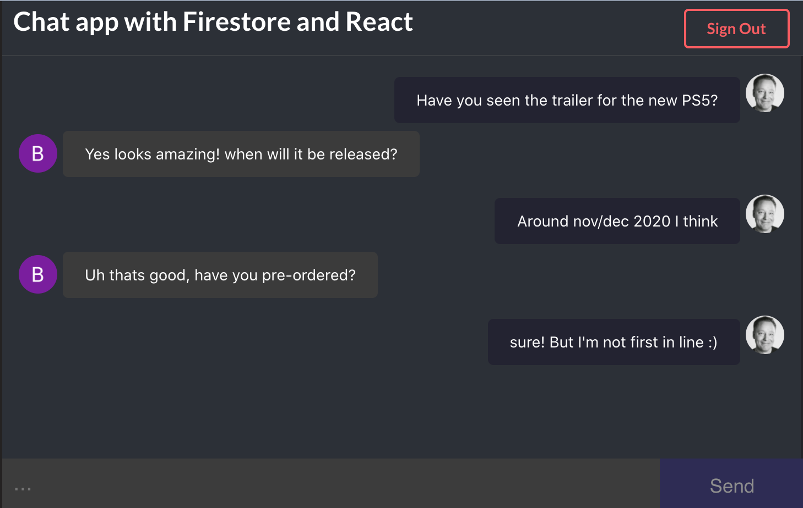

## Project building a Chat App with React, Firebase, Firestore and Google Auth.

* Login using Google auth.
* Chat on

#### Tech used: 
- JavaScript
- React
- Google Firebase
- Google Firestore
- Google Auth
- react-firebase-hooks
- react-scripts
- Semantic-UI
- VS Code

## View it live

https://simple-firechat.netlify.app/

#
